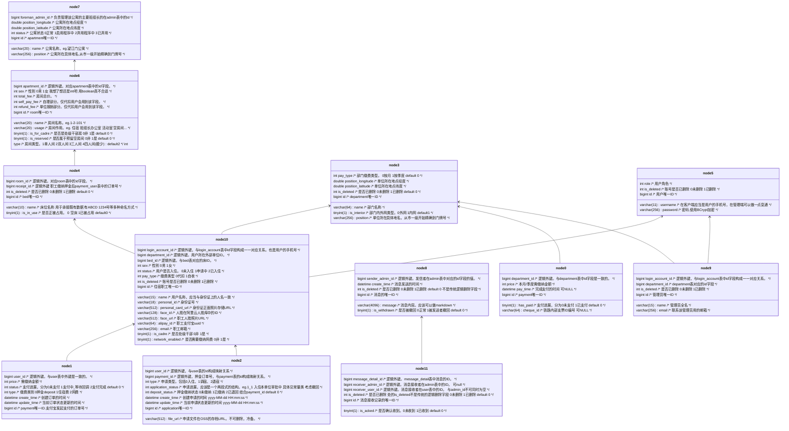

```mermaid
classDiagram
direction BT
class node9 {
   bigint login_account_id  /* 逻辑外键，与login_account表中id字段构成一一对应关系。 */
   varchar(15) name  /* 管理员全名 */
   bigint department_id  /* department表对应的id字段 */
   varchar(256) email  /* 联系该管理员用的邮箱 */
   int is_deleted  /* 是否已删除 0未删除 1已删除 */
   bigint id  /* 管理员唯一ID */
}
class node7 {
   bigint foreman_admin_id  /* 负责管理该公寓的主要班组长的在admin表中的id */
   varchar(20) name  /* 公寓名称，eg.望江门公寓 */
   varchar(256) position  /* 公寓所在具体地名,从市一级开始精确到门牌号 */
   double position_longitude  /* 公寓所在地点经度 */
   double position_latitude  /* 公寓所在地点纬度 */
   int status  /* 公寓状态 0正常 1启用程序中 2弃用程序中 3已弃用 */
   bigint id  /* apartment唯一ID */
}
class node2 {
   bigint user_id  /* 逻辑外键，与user表的id构成映射关系 */
   bigint payment_id  /* 逻辑外键，押金订单号，与payment表的id构成映射关系。 */
   int type  /* 申请类型。包括0入住、1调宿、2退宿 */
   varchar(512) file_url  /* 申请文件在OSS的存档URL。不可删除，冷备。 */
   int application_status  /* 申请进展，应该是一个两段式的结构。eg.1_1 入住本单位审批中 具体见常量类 考虑撤回 */
   int deposit_status  /* 押金缴纳状态 0未缴纳 1已缴纳 2已退回 结合payment_id default 0 */
   datetime create_time  /* 创建申请的时间 yyyy-MM-dd HH:mm:ss */
   datetime update_time  /* 当前申请状态更新的时间 yyyy-MM-dd HH:mm:ss */
   bigint id  /* application唯一ID */
}
class node4 {
   bigint room_id  /* 逻辑外键。对应room表中的id字段。 */
   varchar(10) name  /* 床位名称 用于承接既有数据 有ABCD 1234号等多种命名方式 */
   bigint receipt_id  /* 逻辑外键 职工缴纳押金后payment_user表中的订单号 */
   tinyint(1) is_in_use  /* 是否正被占用。 0 空床 1已被占用 default0 */
   int is_deleted  /* 是否已删除 0未删除 1已删除 default 0 */
   bigint id  /* bed唯一ID */
}
class node3 {
   varchar(64) name  /* 部门名称 */
   tinyint(1) is_interior  /* 部门内外网类型。0外网 1内网 default1 */
   int pay_type  /* 部门缴费类型。 0按月 1按季度 default 0 */
   varchar(256) position  /* 单位所在具体地名，从市一级开始精确到门牌号 */
   double position_longitude  /* 单位所在地点经度 */
   double position_latitude  /* 单位所在地点纬度 */
   int is_deleted  /* 是否已删除 0未删除 1已删除 default 0 */
   bigint id  /* department唯一ID */
}
class node5 {
   varchar(11) username  /* 在客户端应当是用户的手机号，在管理端可以做一点变通 */
   varchar(256) password  /* 密码,使用BCrypt加密 */
   int role  /* 用户角色 */
   int is_deleted  /* 账号是否已删除 0未删除 1已删除 */
   bigint id  /* 用户唯一ID */
}
class node8 {
   varchar(4096) message  /* 消息内容。应该可以做markdown */
   bigint sender_admin_id  /* 逻辑外键。发信者在admin表中对应的id字段的值。 */
   datetime create_time  /* 消息发送的时间 */
   tinyint(1) is_withdrawn  /* 是否被撤回 0正常 1被发送者撤回 default 0 */
   int is_deleted  /* 是否已删除 0未删除 1已删除 default 0 不是传统逻辑删除字段 */
   bigint id  /* 消息的唯一ID */
}
class node11 {
   bigint message_detail_id  /* 逻辑外键。message_detail表中消息的ID。 */
   bigint receiver_admin_id  /* 逻辑外键。消息接收者在admin表中的ID。 可null */
   bigint receiver_user_id  /* 逻辑外键。消息接收者在user表中的ID。 与admin_id不可同时为空 */
   tinyint(1) is_acked  /* 是否确认收到。0未收到 1已收到 default 0 */
   int is_deleted  /* 是否已删除 处的is_deleted不是传统的逻辑删除字段 0未删除 1已删除 default 0 */
   bigint id  /* 消息接收记录的唯一ID */
}
class node0 {
   bigint department_id  /* 逻辑外键。与department表中id字段是一致的。 */
   int price  /* 本月/季度需缴纳金额 */
   tinyint(1) has_paid  /* 支付进展，分为0未支付 1已支付 default 0 */
   varchar(64) cheque_id  /* 铁路内部支票ID编号 可NULL */
   datetime pay_time  /* 完成支付的时间 可NULL */
   bigint id  /* payment唯一ID */
}
class node1 {
   bigint user_id  /* 逻辑外键。与user表中外键是一致的。 */
   int price  /* 需缴纳金额 */
   int status  /* 支付进展，分为0未支付 1支付中\_等待回调 2支付完成 default 0 */
   int type  /* 缴费类别 0押金deposit 1住宿费 2网费 */
   datetime create_time  /* 创建订单的时间 */
   datetime update_time  /* 当前订单状态更新的时间 */
   bigint id  /* payment唯一ID.支付宝发起支付的订单号 */
}
class node6 {
   bigint apartment_id  /* 逻辑外键。对应apartment表中的id字段。 */
   varchar(20) name  /* 房间名称。eg.1-2-101 */
   varchar(20) usage  /* 房间作用。eg. 住宿 班组长办公室 活动室 空房间...  */
   tinyint(1) is_for_cadre  /* 是否是处级干部房 0非 1是 default 0 */
   tinyint(1) is_reserved  /* 是否属于预留空房间 0非 1是 default 0 */
   int sex  /* 性别 0男 1女 我想了想还是int吧 用boolean真不合适 */
   type  /* 房间类型。1单人间 2双人间 3三人间 4四人间(极少) default2 */ int
   int total_fee  /* 房间总价。 */
   int self_pay_fee  /* 自理部分。仅代扣用户会用到该字段。 */
   int refund_fee  /* 单位报销部分。仅代扣用户会用到该字段。 */
   bigint id  /* room唯一ID */
}
class node10 {
   bigint login_account_id  /* 逻辑外键，与login_account表中id字段构成一一对应关系。也是用户的手机号 */
   bigint department_id  /* 逻辑外键。用户所在外部单位ID。 */
   bigint bed_id  /* 逻辑外键。与bed表对应的床ID。 */
   varchar(15) name  /* 用户名称，应当与身份证上的人名一致 */
   varchar(18) personal_id  /* 身份证号 */
   varchar(512) personal_card_url  /* 身份证正面照片存储URL */
   varchar(128) face_id  /* 人脸在阿里云人脸库中的ID */
   varchar(512) face_url  /* 职工人脸照片URL */
   varchar(64) alipay_id  /* 职工支付宝uuid */
   varchar(256) email  /* 职工邮箱 */
   int sex  /* 性别 0男 1女 */
   tinyint(1) is_cadre  /* 是否处级干部 0非 1是 */
   int status  /* 用户是否入住。 0未入住 1申请中 2已入住 */
   int pay_type  /* 缴费类型 0代扣 1自收 */
   tinyint(1) network_enabled  /* 是否需要缴纳网费 0非 1是 */
   int is_deleted  /* 账号是否已删除 0未删除 1已删除 */
   bigint id  /* 住宿职工唯一ID */
}

node9  -->  node3
node9  -->  node5
node2  -->  node10
node4  -->  node6
node11  -->  node8
node0  -->  node3
node1  -->  node10
node6  -->  node7
node10  -->  node4
node10  -->  node3
node10  -->  node5

```

