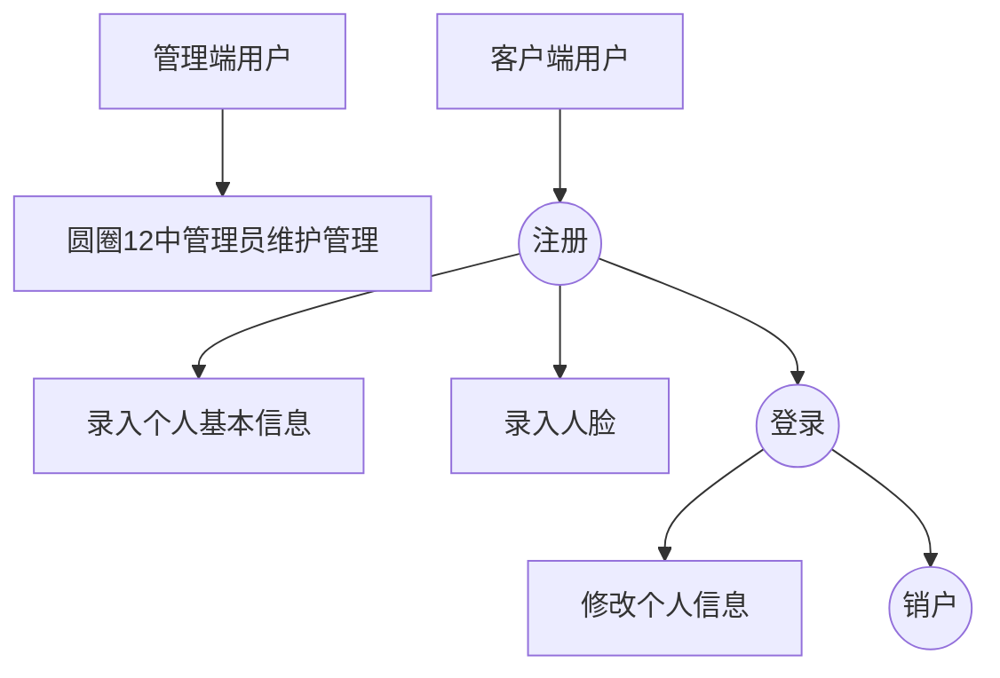

    <h1>
        员工公寓综合系统_详细设计
    </h1>
    <h3>
        王旻安 2023.6.19
    </h3>

## 1. 项目背景

本项目原为上海铁路局杭州房间公寓段于2022年上半年进行招标的管理项目，现已经过抽象与概括。由于在上学期为整个项目定调的时候，我还没有学习基于容器的微服务知识，因此在设计上总体存在与微服务框架不契合、用户故事设定违背服务组高内聚低耦合的问题。我通过本篇内部文档在原有需求的基础上尝试重新设计整个架构。

## 2. 前端

这图还是放在这里做个参考

水电费有关要求移除

### 2.1 技术栈

管理端使用React + Vite + AntDesign

客户端使用Vue + Vite + Vant

### 2.2 预计呈现效果

前端最终应当分为两端。一端为员工公寓系统管理端，呈现形式应类似于一个后台管理系统。另一端员工公寓系统客户端，呈现形式应该是一个H5的移动端网页。两端都有打包的可能性，其中管理端使用Electron打包为exe文件，客户端打包为apk文件。

## 3. 后端

### 3.1 后端技术栈

+ SpringBoot 3.1.0, SpringCloud 2022.2, SpringCloud Alibaba 2022.0.0.0-RC2

### 3.2 服务拆分

根据微服务课程的服务拆分经验，我认为本次项目后端服务可以做如下拆分

+ apartment-gateway：网关，路由与负载均衡
+ apartment-auth：授权模块 jjwt
+ apartment-user：住宿职工管理 会很重 包含了入住调宿退宿状态跟进 圆圈1 2 3 4 6 8
+ apartment-management：管理端实体管理服务 包括人员管理、公寓管理、外部单位管理
+ apartment-finance：财务人员将用到的服务 圆圈5 7
+ apartment-station-message：站内信模块
+ apartment-payment：支付模块 需要有一个每个月触发的XXL来执行这个事情。 圆圈9

除服务模块以外还需要包含

+ apartment-parent：依赖版本
+ apartment-base：基础模块

+ apartment-security-sdk：鉴权模块 除gateway与auth以外其他模块必须依赖

## 4. 业务基本流程

### 4.1 用户信息维护

### 4.2 入住

### 4.3 调宿

### 4.4 退宿

下图仅包含涉及到的人员，数据流动还包含空床位的变动。

### 4.5 缴费

#### 4.5.1 代扣

代扣是指住宿职工的住房费用从职工每月工资中扣除。在本项目中的体现为房建公寓段与外部单位之间的催收与缴费函、表的交互。实际上的缴费过程是不经过Alipay的，走的是房建公寓段内部的欠条(很奇妙的体系，但就是这样的)。

#### 4.5.2 自收

自收是指住宿职工直接向房建公寓段缴纳住宿费用，和用户所属单位无关。需要走支付宝流程。

## 5. 迭代划分

按照软件系统开发综合能力训练实践指导书中的安排，本次项目按照敏捷流程需要进行三次迭代。结合上学期的迭代划分，现大体上明确三次迭代如下。具体的用户故事可以在使用`youtrack`重新安排工作时进行补足。

### 5.0 准备阶段

项目章程，项目管理计划书编写。`youtrack`大抵是要新开项目。敲定接口文档(前后端多次会议)。搭建MySQL数据库，构建ElasticSearch映射。

### 5.1 第一次迭代

#### 5.1.1 前端

理论上高杨旭小朋友应该在准备高等数学考试，我要写后端，前端在第一次迭代中没有实际开发工作。

#### 5.1.2 后端

后端项目框架搭建，需要完成非核心部分的复制与适配，调通接口。需要完成以下6个模块。如果最后的迭代需要按照用户故事算，那就把非核心模块的用户故事映射上去。

+ apartment-parent：依赖版本
+ apartment-base：基础模块
+ apartment-security-sdk：鉴权模块 除gateway与auth以外其他模块必须依赖
+ apartment-gateway：网关，路由与负载均衡
+ apartment-auth：授权模块 jjwt
+ apartment-user：住宿职工管理 会很重 包含了入住调宿退宿状态跟进 圆圈1 2 3 4 6 8

可能会涉及到的难点有用户人脸的采集与录入，需要结合阿里云人脸SDK，待查。第一次迭代就需要完成配置`Sonarqube`前端与后端代码质量检查。同时尝试在K8S集群上部署非核心模块，供前端调用。如果时间不足，部署工作可延后到周末。

#### 5.1.3 服务器

开发环境搭建，部署K8S集群，部署`Kubesphere`。预计需要一个master与两个worker节点。

部署Redis-sentinel集群。部署`Nacos`，部署`Sonarqube`，部署`canal-admin,canal-server`。搭建自动化CI/CD流程。

可能会涉及到的难点有K8S集群部署，canal部署。如果K8S方案失败则采用docker-hub配合docker-compose的方案。如果canal部署失败则采用手动同步方案。

### 5.2 第二次迭代

#### 5.2.1 前端

理论上高杨旭小朋友应该已经考完高等数学考试可以开始干活了。我还在写后端。所以第二次迭代前端的主要工作应该是对接后端在第一次迭代中开发的接口，主要是搭建RABC框架，用户登录与动态导航。如果时间多余，可以提前开始根据接口文档mock后端status管理的模块。

#### 5.2.2 后端

我希望本阶段连同周末，后端应该完成剩下的业务核心模块。

+ apartment-management：管理端实体管理服务 包括人员管理、公寓管理、外部单位管理
+ apartment-finance：财务人员将用到的服务 圆圈5 7
+ apartment-station-message：站内信模块
+ apartment-payment：支付模块 需要有一个每个月触发的XXL来执行这个事情。 圆圈9

如果时间实在不足，顶多可以把payment延后到第三次迭代，但这是极其不理想的情况。

我要单独讲一讲这个message模块。由于微服务课写的chat模块实在是不能让人满意，我希望做一些完善。站内信的主要作用是发送广播信息并查看确认状态。我们将用表6.1.10,6.1.11来实现这个模块。

#### 5.2.3 服务器

如果在第一次迭代的过程中完成了环境配置那么这一次迭代中基本没有什么大问题了。

### 5.3 第三次迭代

本阶段同时应当完成web的软件化打包工作。

#### 5.3.1 前端

管理端在本次迭代中应当跟进后端在第二次迭代中完成的内容。我现在能联想到的是status的跟进应该要用到Timeline组件。

客户端要在本次迭代内完成所有工作。代码量上应该是不多的。我突然想到我们既然已经有高德地图的经验了那么甚至可以嵌一个导航进去。

#### 5.3.2 后端

如果payment模块没写完的话，需要在第三次迭代完成。其他应该就是一些调优工作。

#### 5.3.3 服务器

联调联试

## 6. 数据库设计

根据阿里巴巴编码规范，我们在数据库设计中不使用外键，仅用编码进行维护。所有数据库之间的映射关系将在本部分文档中进行约定，在编码时需注意联系多表关系。

由于上述不使用外键的原因，JPA等与数据库重耦合的ORM框架已不在本次业务考虑范围内。同时由于业务逻辑较为简单，不存在接口复用需求，所以本次开发仍基于贫血模型而非[领域驱动设计DDD](https://tech.meituan.com/2017/12/22/ddd-in-practice.html)。因此在技术选型时ORM仍采用`MyBatis`系的`MyBatisPlus`或`MyBatis-Native`。

### 6.1 关系型数据库规划

大量int的枚举型数据需要用`enum`与其对应。不可使用魔法数字。理论上微服务项目是要分库的，但因为复用的地方比较多，耦合的还是有点高，所以暂缓这个想法。

#### 6.1.1 `login_account`

本Entity是与Security紧密耦合的。全表一切字段not null。只包含于登录有关的内容。

| 列名       | 数据类型     | 备注                                               |
| ---------- | ------------ | -------------------------------------------------- |
| id         | bigint       | primary key; auto increment; 用户唯一ID            |
| username   | varchar(11)  | 在客户端应当是用户的手机号，在管理端可以做一点变通 |
| password   | varchar(255) | 密码 BCrypt加密                                    |
| role       | int          | 用户角色，根据需求表有8种不同角色，需要有Enum对应  |
| is_deleted | int          | 账号是否已删除 0未删除 1已删除 default 0           |

#### 6.1.2 `admin`

管理员表。记录**外部单位**管理员的基础信息。管理员与department应当构成多对一的关系。该表中非标明字段均应当为not null。

| 列名             | 数据类型     | 备注                                                  |
| ---------------- | ------------ | ----------------------------------------------------- |
| id               | bigint       | primary key; auto increment; 管理员唯一ID             |
| login_account_id | bigint       | 逻辑外键，与login_account表中id字段构成一一对应关系。 |
| name             | varchar(15)  | 管理员全名                                            |
| department_id    | bigint       | department表对应的id字段                              |
| email            | varchar(255) | 联系该管理员用的邮箱                                  |

#### 6.1.3 `user`

用户表，记录住宿职工基础信息，与`login_account`构成0-1对1的基础关系。login_account中每一条住宿职工的记录对应一条user表中的记录。各级管理员只需要login_account即可。该表中非标明字段均应当为not null。

| 列名              | 数据类型     | 备注                                                         |
| ----------------- | ------------ | ------------------------------------------------------------ |
| id                | bigint       | primary key; auto increment; 用户唯一ID                      |
| login_account_id  | bigint       | 逻辑外键，与login_account表中id字段构成一一对应关系。也是用户的手机号 |
| department_id     | bigint       | 逻辑外键。用户所在单位ID                                     |
| bed_id            | bigint       | 逻辑外键。与bed表对应的床ID unique **可null**                |
| name              | varchar(20)  | 用户名称，应当与身份证上的人名一致                           |
| personal_id       | varchar(18)  | 身份证号                                                     |
| personal_card_url | varchar(511) | 身份证正面URL                                                |
| face_url          | varchar(511) | 人脸URL                                                      |
| alipay_id         | varchar(127) | 支付宝uuid                                                   |
| email             | varchar(255) | 用户邮箱 **可null** 用于发送通知                             |
| sex               | int          | 性别 0男 1女 我想了想还是int吧 用boolean真不合适             |
| is_cadre          | tinyint      | 是否处级干部 0非 1是 default 0                               |
| status            | int          | 用户是否入住。 0未入住 1申请中 2已入住 default 0             |
| pay_type          | tinyint      | 缴费是否自收类型 0非 1是 default 0                           |
| network_enabled   | tinyint      | 是否需要缴纳网费 0非 1是 default 0                           |
| is_deleted        | int          | 账号是否已删除 0未删除 1已删除 default 0                     |

network_enabled这个字段放在user表里面是因为每个职工的网费在现行系统中是单独收取的。

#### 6.1.4 `apartment`

公寓表，记录了公寓名称与所在地理位置。与班组长的`login_account`账号构成一一对应关系。该表中非标明字段均应当为not null。

| 列名               | 数据类型     | 备注                                                     |
| ------------------ | ------------ | -------------------------------------------------------- |
| id                 | bigint       | primary key; auto increment; apartment唯一ID             |
| foreman_admin_id   | bigint       | 负责管理该公寓的主要班组长的在admin表中的id **可null**   |
| name               | varchar(20)  | 公寓名称，eg.望江门公寓                                  |
| position           | varchar(255) | 公寓所在具体地名                                         |
| position_longitude | double       | 公寓所在地点经度                                         |
| position_latitude  | double       | 公寓所在地点纬度                                         |
| status             | int          | 公寓状态 0正常 1启用程序中 2弃用程序中 3已弃用 default 0 |

#### 6.1.5 `room`

房间表。和公寓构成一对多的关系。每间room都对应了一个apartment。该表中非标明字段均应当为not null。

| 列名         | 数据类型    | 备注                                                         |
| ------------ | ----------- | ------------------------------------------------------------ |
| id           | bigint      | primary key; auto increment; room唯一ID                      |
| apartment_id | bigint      | 逻辑外键。对应apartment表中的id字段。                        |
| name         | varchar(50) | 房间名称。eg.1-2-101.鉴于老总表中对房间有多种分划命名方式，这里用varchar。 |
| usage        | varchar(50) | 房间作用。eg. 住宿 班组长办公室 活动室 空房间... default "住宿" |
| is_for_cadre | tinyint     | 是否是处级干部房 0非 1是 default 0                           |
| is_reserved  | tinyint     | 是否属于预留空房间 0非 1是 default 0                         |
| type         | int         | 房间类型。1单人间 2双人间 3三人间 4四人间(极少)              |
| total_fee    | int         | 房间总价。                                                   |
| self_pay_fee | int         | 自理部分。仅代扣用户会用到该字段。                           |
| refund_fee   | int         | 单位报销部分。仅代扣用户会用到该字段。                       |

$total\_fee = self\_pay\_fee + refund\_fee$ 费用这玩意放在room这里是因为一个room里所有bed的价钱都是一样的。

#### 6.1.6 `bed`

床表。每一`room`由于`type`的不同对应1-4张`bed`。每一个`user`对应0/1张`bed`。该表中非标明字段均应当为not null。

| 列名       | 数据类型    | 备注                                                  |
| ---------- | ----------- | ----------------------------------------------------- |
| id         | bigint      | primary key; auto increment; bed唯一ID                |
| room_id    | bigint      | 逻辑外键。对应room表中的id字段。                      |
| name       | varchar(10) | 床位名称 用于承接既有数据 有ABCD 1234号等多种命名方式 |
| receipt_id | bigint      | 为当前住宿职工缴纳押金行为生成的唯一ID **可null**     |
| is_in_use  | tinyint     | 是否正被占用。 0 空床 1已被占用 default0              |

#### 6.1.7 `department`

部门表。部门与职工是1对多的关系。该表中非标明字段均应当为not null。

| 列名               | 数据类型     | 备注                                          |
| ------------------ | ------------ | --------------------------------------------- |
| id                 | bigint       | primary key; auto increment; department唯一ID |
| name               | varchar(64)  | 部门名称                                      |
| is_interior        | tinyint      | 部门内外网类型。0外网 1内网 default1          |
| pay_type           | int          | 部门缴费类型。 0按月 1按季度 default0         |
| position           | varchar(255) | 单位所在具体地名                              |
| position_longitude | double       | 单位所在地点经度                              |
| position_latitude  | double       | 单位所在地点纬度                              |

#### 6.1.8 `application`

申请表，用于存储一切申请材料，本质上是一个到OSS的映射。包括入住申请、调宿申请、退宿申请。与user表中的status字段应当是同步变动的。所有时间最终应当被格式化为yyyy-MM-dd HH:mm:ss的格式。我们最后要导出变动表时基于的也是这张表。该表中非标明字段均应当为not null。

| 列名        | 数据类型     | 备注                                                         |
| ----------- | ------------ | ------------------------------------------------------------ |
| id          | bigint       | primary key; auto increment; application唯一ID               |
| user_id     | bigint       | 逻辑外键，与user表的id行程映射关系                           |
| type        | int          | 申请类型。包括0入住、1调宿、2退宿                            |
| file_url    | varchar(511) | 申请文件在OSS的存档URL。不可删除，冷备。                     |
| status      | varchar(10)  | 申请进展，应该是一个两段式的结构。eg.0_1 入住本单位审批中 具体见常量类 |
| create_time | datetime     | 创建申请的时间                                               |
| update_time | datetime     | 当前申请状态更新的时间                                       |

#### 6.1.9 `payment`

住宿缴费表。用于存储所有的缴费记录。到时候要导出缴费记录用的就是这张表。该表中非标明字段均应当为not null。

| 列名        | 数据类型 | 备注                                                         |
| ----------- | -------- | ------------------------------------------------------------ |
| id          | bigint   | primary key; auto increment; payment唯一ID.支付宝发起支付的订单号 |
| user_id     | bigint   | 逻辑外键。与user表中外键是一致的。                           |
| status      | int      | 支付进展，分为0未支付 1支付中\_等待回调 2支付完成 3代扣\_须手动确认 |
| create_time | datetime | 创建申请的时间                                               |
| update_time | datetime | 当前申请状态更新的时间                                       |

#### 6.1.10 `message_detail`

消息表。我其实也很纠结这玩意到底是放在缓存还是放在SQL里面。这玩意终归是要留档的不能过期，所以还是存在一张表里算了。本表值存储消息内容、消息发送人与发送时间。该表中非标明字段均应当为not null。

| 列名            | 数据类型      | 备注                                                 |
| --------------- | ------------- | ---------------------------------------------------- |
| id              | bigint        | primary key; auto increment;消息的唯一ID             |
| message         | varchar(4095) | 消息内容。应该可以做富文本。具体实现和前端开会后决定 |
| sender_admin_id | bigint        | 逻辑外键。发信者在admin表中对应的id字段。            |
| create_time     | datetime      | 消息发送的时间                                       |
| is_withdrawn    | tinyint       | 是否被撤回 0正常 1被发送者撤回 default 0             |

#### 6.1.11`message_receiving`

消息接收表。该表中非标明字段均应当为not null。

| 列名              | 数据类型 | 备注                                             |
| ----------------- | -------- | ------------------------------------------------ |
| id                | bigint   | primary key; auto increment;消息接收记录的唯一ID |
| message_detail_id | bigint   | 逻辑外键。message_detail表中消息的ID。           |
| receiver_user_id  | bigint   | 逻辑外键。消息接收者在user表中的ID。             |
| is_acked          | tinyint  | 是否确认收到。0未收到 1已收到 default 0          |

### 6.2 非关系型数据库规划

#### 6.2.1 ElasticSearch

ElasticSearch主要的功用应当是搜索。经过思考后主要可以做两类搜索：

+ 用户数据。本项目不可避免地包含极大量的用户数据，因此可以引入用户数据搜索。
+ 公寓数据。由于我们需要根据工作单位地点就近安排员工住宿，可以有效利用ElasticSearch的GEO_POINT功能。
+ 站内信数据。对长站内信内容进行搜索显然已经超出了

#### 6.2.2 Redis

Redis的主要工作是缓存，缓存一些不经常发生变动的数据。

+ 用户登录信息。包括token与login_account的缓存。
+ 缓存各外部单位与公寓的基础数据。由于房间的信息是变动比较频繁的，所以直接做SQL就可以了。

实际上用到的key将在Constants中进行声明。
