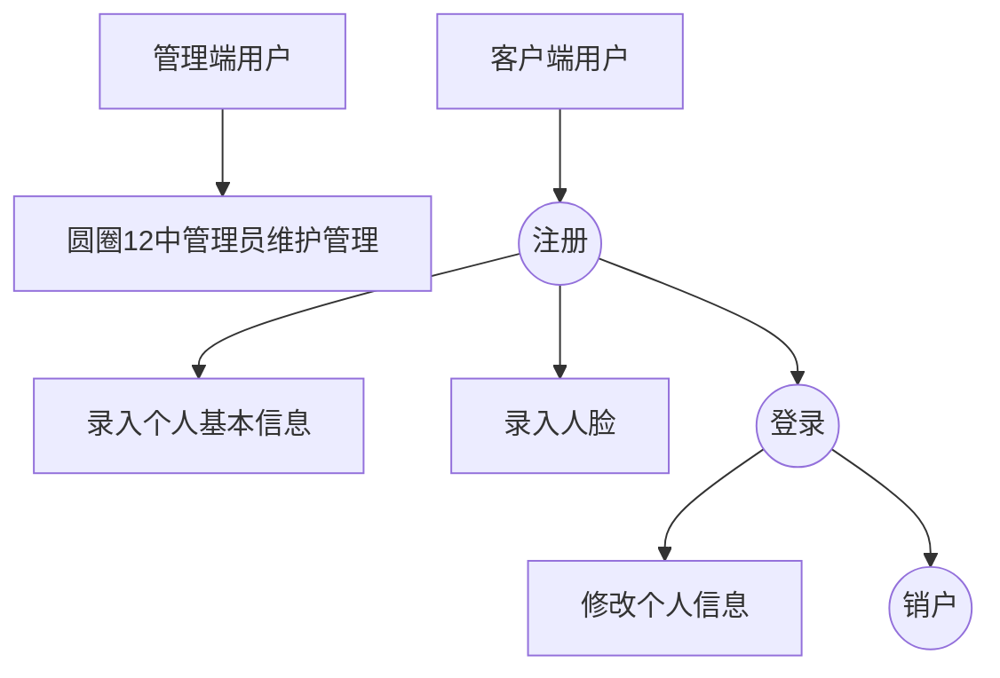

    <h1>
        员工公寓综合系统_详细设计
    </h1>
    <h3>
        王旻安 2023.6.19
    </h3>

## 1. 项目背景

本项目原为上海铁路局杭州房间公寓段于2022年上半年进行招标的管理项目，现已经过抽象与概括。由于在上学期为整个项目定调的时候，我还没有学习基于容器的微服务知识，因此在设计上总体存在与微服务框架不契合、用户故事设定违背服务组高内聚低耦合的问题。

## 2. 前端

这图还是放在这里做个参考

水电费有关要求移除

### 2.1 技术栈

管理端使用React + Vite + AntDesign

客户端使用Vue + Vite + Vant

### 2.2 预计呈现效果

前端最终应当分为两端。一端为员工公寓系统管理端，呈现形式应类似于一个后台管理系统。另一端员工公寓系统客户端，呈现形式应该是一个H5的移动端网页。两端都有打包的可能性，其中管理端使用Electron打包为exe文件，客户端打包为apk文件。

## 3. 后端

### 3.1 后端技术栈

+ SpringBoot 3.1.0, SpringCloud 2022.2, SpringCloud Alibaba 2022.0.0.0-RC1

### 3.2 服务拆分

根据微服务课程的服务拆分经验，我认为本次项目后端服务可以做如下拆分

+ apartment-gateway：网关，路由与负载均衡
+ apartment-auth：授权模块 jjwt
+ apartment-user：用户管理
+ apartment-status：入住调宿退宿状态跟进 最重的部分 圆圈1 2 3 4 6 8
+ apartment-finance：财务人员将用到的服务 圆圈5 7
+ apartment-payment：支付模块 需要有一个每个月触发的XXL来执行这个事情。 圆圈9

除服务模块以外还需要包含

+ apartment-parent：依赖版本
+ apartment-base：基础模块

+ apartment-security-sdk：鉴权模块 除gateway与auth以外其他模块必须依赖

## 4. 业务基本流程

### 4.1 用户信息维护

### 4.2 入住

### 4.3 调宿

### 4.4 退宿

下图仅包含涉及到的人员，数据流动还包含空床位的变动。

### 4.5 缴费

#### 4.5.1 代扣

代扣是指住宿职工的住房费用从职工每月工资中扣除。在本项目中的体现为房建公寓段与外部单位之间的催收与缴费函、表的交互。实际上的缴费过程是不经过Alipay的，走的是房建公寓段内部的欠条(很奇妙的体系，但就是这样的)。

#### 4.5.2 自收

自收是指住宿职工直接向房建公寓段缴纳住宿费用，和用户所属单位无关。需要走支付宝流程。

## 5. 迭代划分

按照软件系统开发综合能力训练实践指导书中的安排，本次项目按照敏捷流程需要进行三次迭代。结合上学期的迭代划分，现大体上明确三次迭代如下。具体的用户故事可以在使用`youtrack`重新安排工作时进行补足。

### 5.0 准备阶段

项目章程，项目管理计划书编写。`youtrack`大抵是要新开项目。敲定接口文档(前后端多次会议)。搭建MySQL数据库，构建ElasticSearch映射。

### 5.1 第一次迭代

#### 5.1.1 前端

理论上高杨旭小朋友应该在准备高等数学考试，我要写后端，前端在第一次迭代中没有实际开发工作。

#### 5.1.2 后端

后端项目框架搭建，需要完成非核心部分的复制与适配，调通接口。非核心部分指除了下面三个模块以外的其他模块。如果最后的迭代需要按照用户故事算，那就把非核心模块的用户故事映射上去。

+ apartment-status：入住调宿退宿状态跟进 最重的部分 圆圈1 2 3 4 6 8
+ apartment-finance：财务人员将用到的服务 圆圈5 7
+ apartment-payment：支付模块 需要有一个每个月触发的XXL来执行这个事情。 圆圈9

可能会涉及到的难点有用户人脸的采集与录入，需要结合阿里云人脸SDK，待查。第一次迭代就需要完成配置`Sonarqube`前端与后端代码质量检查。同时尝试在K8S集群上部署非核心模块，供前端调用。如果时间不足，部署工作可延后到周末。

#### 5.1.3 服务器

开发环境搭建，部署K8S集群，部署`Kubesphere`。预计需要一个master与两个worker节点。

部署Redis-sentinel集群。部署`Nacos`，部署`Sonarqube`，部署`canal-admin,canal-server`。搭建自动化CI/CD流程。

可能会涉及到的难点有K8S集群部署，canal部署。如果K8S方案失败则采用docker-hub配合docker-compose的方案。如果canal部署失败则采用手动同步方案。

### 5.2 第二次迭代

#### 5.2.1 前端

理论上高杨旭小朋友应该已经考完高等数学考试可以开始干活了。我还在写后端。所以第二次迭代前端的主要工作应该是对接后端在第一次迭代中开发的接口，主要是搭建RABC框架，用户登录与动态导航。如果时间多余，可以提前开始根据接口文档mock后端status管理的模块。

#### 5.2.2 后端

我希望本阶段连同周末，后端应该完成剩下的业务核心模块。

+ apartment-status：入住调宿退宿状态跟进 最重的部分 圆圈1 2 3 4 6 8
+ apartment-finance：财务人员将用到的服务 圆圈5 7
+ apartment-payment：支付模块 需要有一个每个月触发的XXL来执行这个事情。 圆圈9

如果时间实在不足，顶多可以把payment延后到第三次迭代，但这是极其不理想的情况。