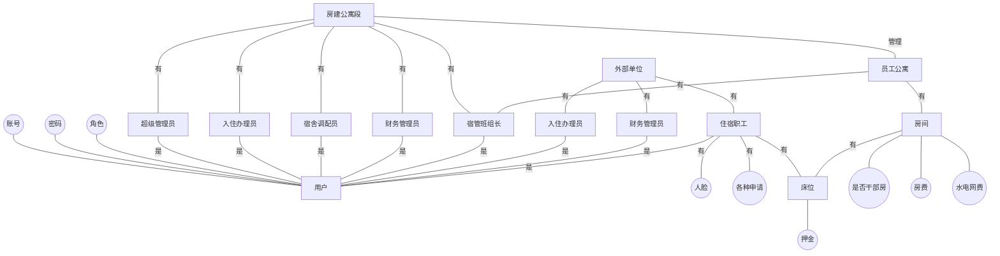

    <h1>
        员工公寓综合系统_需求分析
    </h1>
    <h3>
        王旻安 2023.6.20
    </h3>

## 0. 需求分析图

## 1. 管理端与客户端

我们可以预计的是，管理端将是一个非常重的RABC系统。

我们可以将上图顶部的超级管理员部分合并为一个整体，这样上图中应该有八个角色，包含七个管理端角色与一个客户端角色。

## 2. 实体关系图

先画成这样 可以继续补充

